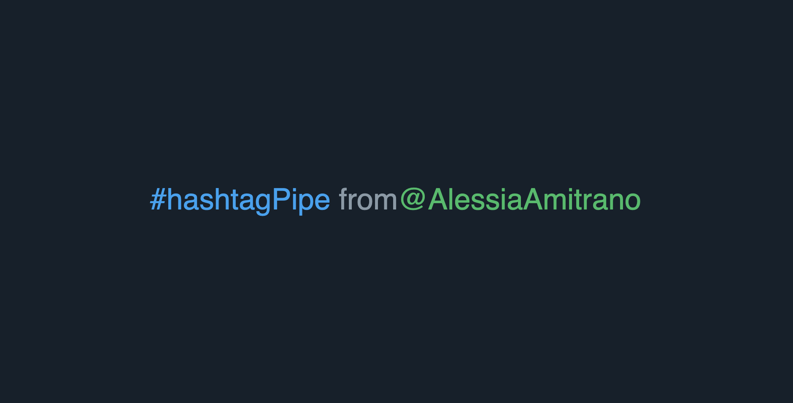

#Angular Hashtag and Mentions Colorizer

> A small library to detect and color mentions and hashtags in texts

[![NPM Version][npm-image]][npm-url]
[![Downloads Stats][npm-downloads]][npm-url]

This library finds hashtags and mentions in a text and applies a chosen color to them.



## Installation

```sh
npm install ng-hashtag-mention-colorizer --save
```

## Usage example

This library was developed to highlight hashtags and mentions in tweets coming from Twitter API. It can be used with every social network feed since it just takes a string as parameter and finds hashtags and mentions in it returning a copy of the same string with the found elements colored.

To use the functionality, add the library module to your app:

```sh
import { HashtagMentionColLibModule } from 'dist/hashtag-mention-col-lib';
import { BrowserModule } from '@angular/platform-browser';
import { NgModule } from '@angular/core';

import { AppComponent } from './app.component';

@NgModule({
  declarations: [AppComponent],
  imports: [BrowserModule, HashtagMentionColLibModule],
  providers: [],
  bootstrap: [AppComponent]
})
export class AppModule {}
```

At this point, it is possible to use the pipe in our templates. ATTENTION: The pipe only works by passing the processed string to an HTML element throught the [innerHtml] property.

It is possible to assign a custom color to ashtags and mentions. In case no color is defined, the library will use the default color #1ca1f3

```sh
<div class="container">
  <span [innerHTML]="hashtag | hmColor"></span>
  <span [innerHTML]="mention | hmColor: '#18BE63'"></span>
</div>
```

## Release History

- 1.0.0
  - The first proper release
- 0.0.1
  - Work in progress

## Meta

Your Name – [@AlleAmitrano](https://twitter.com/AlleAmitrano) – alessia.amitranobo@gmail.com

Distributed under the MIT license. See `LICENSE` for more information.

[https://github.com/alessiaAmitrano/hashtag-mention-colorizer](https://github.com/alessiaAmitrano/hashtag-mention-colorizer)

## Contributing

1. Fork it (<https://github.com/alessiaAmitrano/hashtag-mention-colorizer>)
2. Create your feature branch (`git checkout -b feature/fooBar`)
3. Commit your changes (`git commit -am 'Add some fooBar'`)
4. Push to the branch (`git push origin feature/fooBar`)
5. Create a new Pull Request

<!-- Markdown link & img dfn's -->

[npm-image]: https://img.shields.io/npm/v/hashtag-mention-colorizer.svg?style=flat-square
[npm-url]: https://npmjs.org/package/hashtag-mention-colorizer
[npm-downloads]: https://img.shields.io/npm/dm/hashtag-mention-colorizer.svg?style=flat-square
[travis-image]: https://img.shields.io/travis/dbader/hashtag-mention-colorizer/master.svg?style=flat-square
[travis-url]: https://travis-ci.org/dbader/hashtag-mention-colorizer
[wiki]: https://github.com/alessiaAmitrano/hashtag-mention-colorizer/wiki
